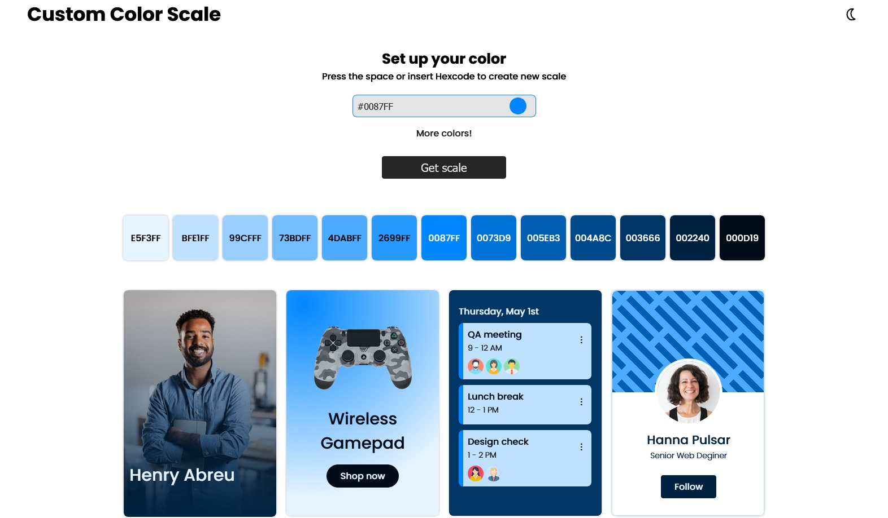

# Custom Color Scale

_You can either [click here](https://gregorim04.github.io/custom-color-scale/) or the picture above to see the live demo site._

## Generate Css and Tailwind color scale 
This is a site to get scale Css and Tailwind format custom scales. Just need to pick a color or provide the preferred one, and get the scale instantly. 

### Features :sparkles:
&check; Provide 8 diferrent inspirational option colors to choose.  
&check; Provide the option input the color you want or pick it from the color wheel.  
&check; Provide 13 color options in the scale  
&check; Provide both Css and Tailwind format options to paste on any project.  
&check; Provide 8 different demo use case for each scale.  

### Possible Improvements :dart:
[x] Better layout Design.  
[x] Better algorithm for the scale creation.  
[] Implement some appealing animations.  
[] Code optimization.  